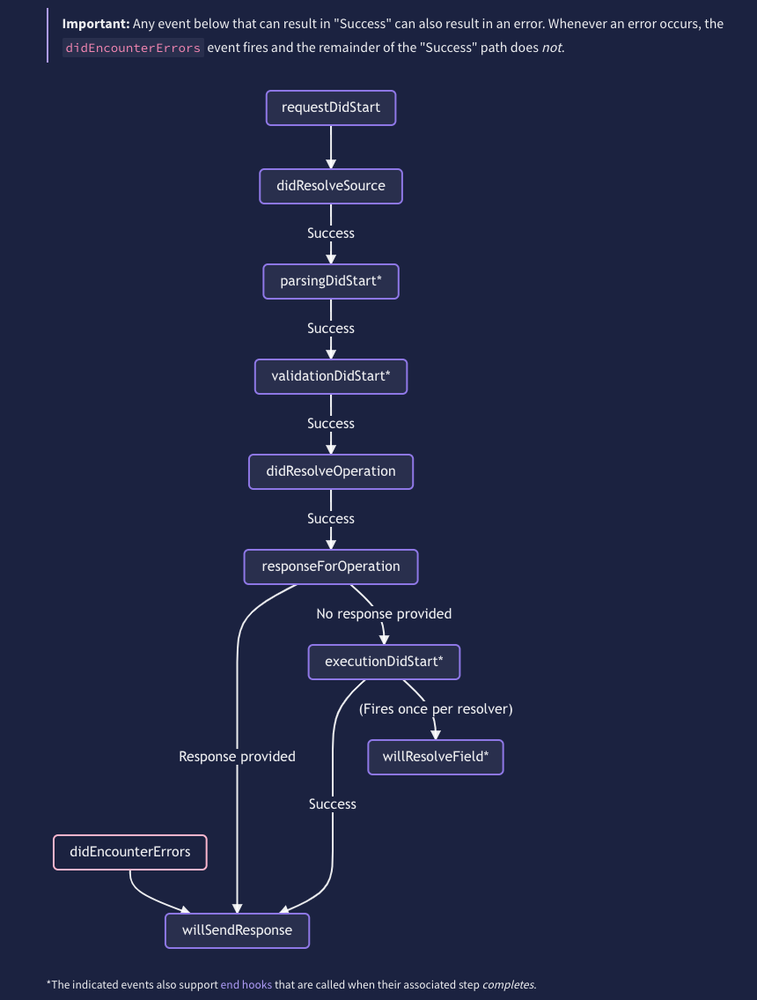

# Part 7: Apollo Plugins

Plugins enable you to extend Apollo Server's core functionality by performing custom operations in response to certain events. Events are fired throughout the lifecycle of both the server as well as a request. [This is a list of supported lifecycle events](https://www.apollographql.com/docs/apollo-server/integrations/plugins-event-reference/).

Below is an example plugin that logs when the GraphQL server is preparing to start up. The `serverWillStart` event is part of the server lifecycle flow.

``` Typescript
const myPlugin: ApolloServerPlugin = ({
    serverWillStart: async () => {
        console.log("Server starting up!");
    }
})
```

1. Create a new file for the example plugin above.
2. Import your new file into `app.ts` and include the plugin to your GraphQL server. 
3. Start the GraphQL server and notice what happens in the logs.

## Responding to request lifecycle events

In this tutorial, we will be creating a plugin that logs each time a request has resulted in an exceptional error (not a business error). The plugin will respond to the `willSendResponse` event. Below is the skeleton code for this plugin.

``` Typescript
export const logErrorPlugin: ApolloServerPlugin = ({
    requestDidStart: async (_requestContext) => ({
        willSendResponse: async (_requestContext) => {
            console.log("will return a response");
        }
    })
})
```

Notice the following:
- The plugin defines the `requestDidStart` function, which in turn returns an object that defines `willSendResponse`. This is because `requestDidStart` is the first _**request**_ lifecycle event fired. Apollo has structured the events in this way so that all request lifecycle logic is encapsulated within `requestDidStart`, making it easier to reason about. See diagram below for sequence of events fired for each request. 

- `requestContext` is passed down between functions. Log this out to see that it contains a bunch of information about your schema, request and response.

_Reference: https://www.apollographql.com/docs/apollo-server/integrations/plugins/_ 

## A side note about introspection queries
If you included the example for for `logErrorPlugin` above and loaded the playground, you would have noticed that several `will return a response` logs occurred even before you submitted a query. This is because the playground sends introspection queries in the background to load the Documentation panel and provide intellisense when you type your query.

An example introspection query looks like:
``` graphql
query {
  __schema {
    queryType {
      fields {
        name
      }
    }
  }
}
  
```

With [GraphQL introspection](https://graphql.org/learn/introspection/), you can ask the GraphQL schema for information about what queries it supports. This includes data like types, fields, queries, mutations, and even the field-level descriptions. The example query above asks for the name of all available queries.

This feature is powerful for building developer tooling, as can be seen in the Apollo playground. However, leaving introspection turned on in production allows bad actors to discover and exploit vulnerablilities. 

For the purpose of this tutorial, you can ignore those requests by updating the plugin with the code below:
``` Typescript
export const logErrorPlugin: ApolloServerPlugin = ({
    requestDidStart: async (_requestContext) => ({
        willSendResponse: async (requestContext) => {
            if (requestContext.request.operationName !== "IntrospectionQuery") {
                console.log("will return a response");
                console.log(requestContext)
            }
        }
    })
})
```

## Log errors 
1. Run a query that returns a successful response. An example could be:
``` graphql
query {
  album(id: "album-2") {
    title
    artist {
      name
    }
  }
}
```
2. Run a query that will return an exceptional error. This will be evident in the response when an `errors` field appears. An example would be replacing the id for the query above with `album-0`.
3. Compare the `requestContext` logged for both requests. What are the differences between them?
4. Using the `requestContext` object, log _only_ when an exceptional error is about to be returned in the response.
5. Run git checkout `7-error-plugin-solution` to see a sample solution.